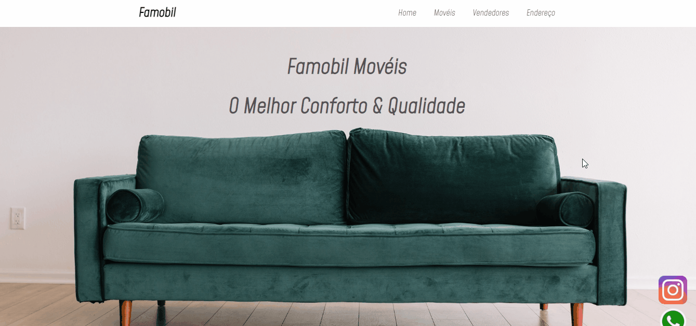

<h1>Prótotipo Loja de Imoveis</h1>

OBS : Todos os dados são inteiramente fícticios

<h1>Sobre</h1>

A projeto consiste em uma loja de divulgação , voltada para o público de venda de imoveis

<h1>Tecnologias</h1>

<li>
    <a href ="https://developer.mozilla.org/pt-BR/docs/Web/HTML">HTML</a>
</li>

<li>
    <a href ="https://developer.mozilla.org/pt-BR/docs/Web/CSS">CSS</a>
</li>

<h1>Pre-requisitos</h1>

Ter alguma plataforma de code como o <a href="https://code.visualstudio.com/">VSCode</a> que permita o uso das tecnologias <a href ="https://developer.mozilla.org/pt-BR/docs/Web/CSS">CSS</a> e <a href ="https://developer.mozilla.org/pt-BR/docs/Web/HTML">HTML</a>

<h1>Imagens GIF</h1>

<h2>Projeto na Web</h2>
<a href="https://relaxed-banach-55a1e3.netlify.app">Famobil Móveis</a>

